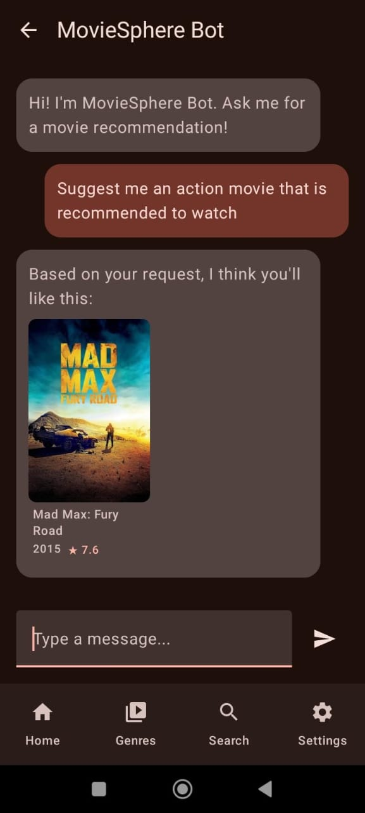

# MovieSphere 🎬

**MovieSphere** is a modern, feature-rich movie discovery application for Android, built with Kotlin and Jetpack Compose. It's designed to help you find your next favorite film through a beautiful, intuitive interface and a smart, AI-powered recommendation chatbot.

---

## ✨ Features

* **Dynamic UI**: A sleek, responsive interface built entirely with Jetpack Compose, supporting both light and dark modes.
* **AI-Powered Chatbot**: Have a natural conversation with a smart chatbot powered by the **Google Gemini API** to get personalized movie recommendations. The chatbot remembers the context of your conversation!
* **Advanced Search**: Instantly search for any movie with a dynamic, debounced search that provides results as you type.
* **Comprehensive Discovery**:
    * Browse popular, trending, and now-playing movies on the home screen.
    * Explore movies by genre.
    * View detailed information for any movie, including its synopsis, runtime, rating, and more.
* **Modern Tech Stack**: Built with the latest Android development standards, including Kotlin Coroutines, Flow, Paging 3 for efficient data loading, and a clean MVVM architecture.
* **Seamless Video Playback**: An integrated "Watch Now" feature to instantly start watching.

---

## 📸 Screenshots

*(Here you can add screenshots of your app)*

| Home Screen                                       | Movie Details                                     | AI Chatbot                                    |
| ------------------------------------------------- | ------------------------------------------------- | --------------------------------------------- |
|  |  |  |

---

## 🛠️ Tech Stack & Libraries

This project is built with a modern tech stack, focusing on best practices for Android development.

* **Language**: [Kotlin](https://kotlinlang.org/)
* **UI**: [Jetpack Compose](https://developer.android.com/jetpack/compose)
* **Architecture**: MVVM (Model-View-ViewModel)
* **Asynchronous Programming**: [Kotlin Coroutines](https://kotlinlang.org/docs/coroutines-overview.html) & [Flow](https://kotlinlang.org/docs/flow.html)
* **Networking**: [Ktor Client](https://ktor.io/docs/client-overview.html)
* **AI**: [Google Gemini API](https://ai.google.dev/)
* **Data Paging**: [Jetpack Paging 3](https://developer.android.com/topic/libraries/architecture/paging/v3-overview)
* **Image Loading**: [Coil](https://coil-kt.github.io/coil/)
* **Navigation**: [Jetpack Navigation Compose](https://developer.android.com/jetpack/compose/navigation)

---

## 📥 Installation

You can install the latest release of the app by following these steps:

1.  Go to the [Releases page](https://github.com/shadowxdgamer/CimaMovieApp/releases).
2.  Download the `MovieSphere-v1.0.apk` file from the latest release.
3.  Transfer the `.apk` file to your Android device and open it.
4.  You may need to grant permission to "install from unknown sources."
5.  Follow the on-screen prompts to install the app. Enjoy!

---

## 📜 License

This project is licensed under the MIT License. See the [LICENSE](LICENSE) file for details.
